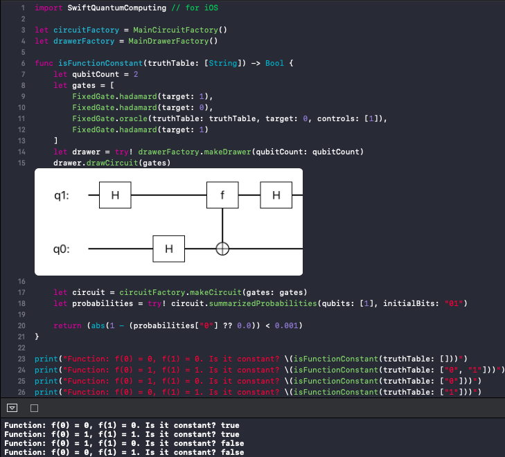
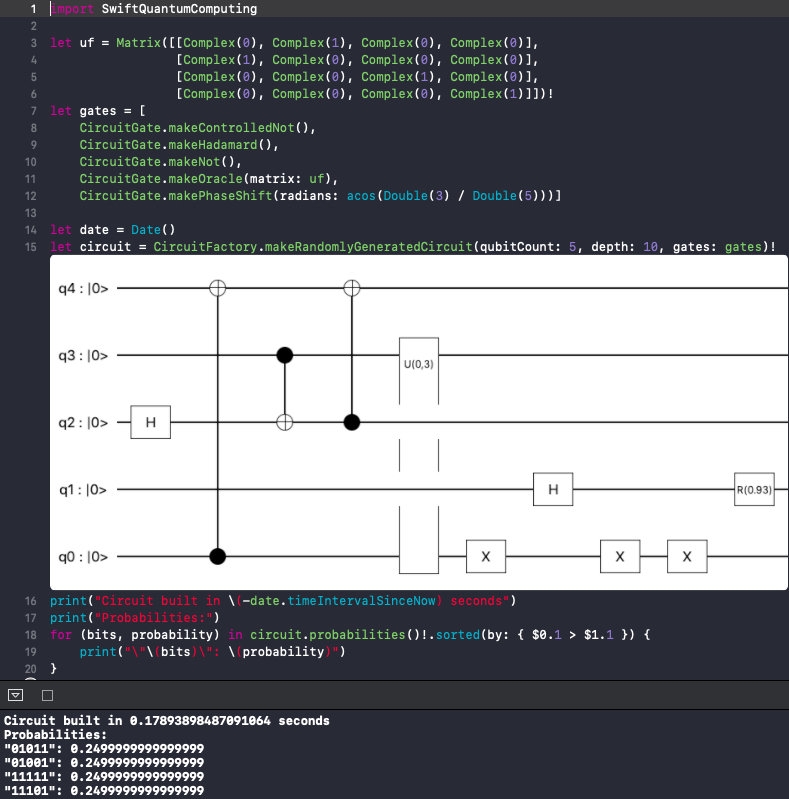

# A Swift quantum circuit simulator

In this repository you can find a simple quantum circuit simulator written in Swift.

The code written so far is mostly based on the content of: [Quantum Computing for Computer Scientists](https://www.amazon.com/Quantum-Computing-Computer-Scientists-Yanofsky/dp/0521879965), with a few tips from [Automatic Quantum Computer Programming: A Genetic Programming Approach](https://www.amazon.com/Automatic-Quantum-Computer-Programming-Approach/dp/038736496X). It is also inspired by [IBM Qiskit](https://github.com/Qiskit/qiskit-terra).

## Usage

To create a circuit gate by gate:

For a more detailed example, check `DeutschAlgorithm.playground`.

Or you can automatically create a circuit adding at random the gates in a list:

